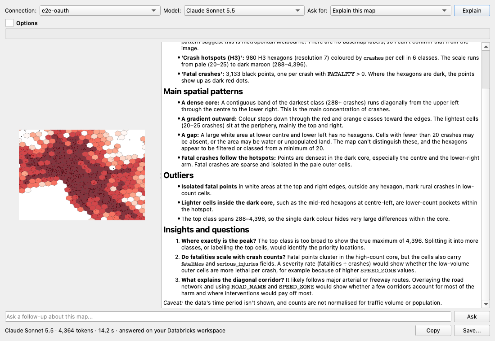

# QGIS Databricks DBSQL Connector

Put your Databricks data on the map. This QGIS plugin loads spatial tables and SQL results from Unity Catalog straight into QGIS, keeps queries live in your projects, and lets you ask Databricks Genie and frontier models about your data, all with your existing Databricks sign-in.



## 📥 Quick Install

1. In QGIS: `Plugins → Manage and Install Plugins`
2. Search for **"Databricks DBSQL Connector"** → Click `Install Plugin`
3. Click the **Databricks icon** → Accept automatic dependency installation
4. **Restart QGIS**

Or install from ZIP: download [`databricks_dbsql_connector.zip`](https://github.com/danny-db/qgis-databricks-connector/releases/latest/download/databricks_dbsql_connector.zip) from the [Releases page](https://github.com/danny-db/qgis-databricks-connector/releases).

New to the plugin? The **[user guide](docs/README.md)** walks through every feature step by step.

## What you can do

| You want to... | Use | Guide |
|---|---|---|
| **Understand a map in seconds**: what it shows, the hotspots and outliers, what to look at next | **Explain this Map**: one click sends the map to a frontier model on your workspace. No API key, no extra subscription | [Explain this Map](docs/12-explain-this-map.md) |
| **Get an answer without knowing where the data lives** | **Genie One**: ask in plain English across the whole workspace, see its charts, and add the results to the map | [Genie One](docs/08-genie-one.md) |
| **Ask a curated dataset a question** | **Genie Agent**: ask a specific Genie Agent; see the SQL, results and charts, and map the answer | [Genie Agent](docs/07-genie-agent.md) |
| **Map a Unity Catalog table** | Discover tables with GEOMETRY or GEOGRAPHY columns, or browse catalogs in the Browser panel, and add them as layers | [Load tables](docs/03-load-tables.md) · [Browser panel](docs/04-browser-panel.md) |
| **Work with tables too big to download** | **Live layers** fetch only what's on screen and refresh as you pan and zoom | [Live layers](docs/05-live-layers.md) |
| **Map any SQL result and keep it in your project** | **Custom Query** with **Save in project**: the query re-runs against Databricks whenever the project opens, like a PostGIS SQL layer | [Custom queries](docs/06-custom-queries.md) |
| **Share a project safely** | Layers link to a saved connection by name, so projects carry no tokens; colleagues open them with their own sign-in | [Security and privacy](docs/10-security-and-privacy.md) |
| **Sign in the way your organisation does** | **OAuth** (browser login / SSO) or a personal access token, on standard and **Lakehouse Real-Time** SQL warehouses | [Connect](docs/02-connect.md) |
| **Use the QGIS you have** | One plugin for QGIS 3 (Qt5) and QGIS 4 (Qt6), on Mac and Windows | [Install](docs/01-install.md) |

## Use cases

The examples use Victorian road-crash data; swap in your own tables. Each takes a few minutes.

### Brief a committee from a map (Explain this Map, new in v1.7.0)
1. Add your layers, style the one that matters (for example **Graduated** on `crashes`, colour ramp *Reds*) and add an OpenStreetMap basemap.
2. Zoom to the area you're discussing and click **Explain this Map** on the toolbar.
3. Read the explanation as it streams in: the area, the hotspots, the outliers. It uses your real layer and field names and the class ranges in your legend.
4. Open **Options → Custom prompt** and ask for your audience, e.g. *"Explain this map for a road safety committee in Victoria, in three bullet points"*.
5. Switch **Ask for** to **Title, caption and alt text** for the report, then **Save...** to keep the Markdown and the map image together.

### Answer a question you have no table for (Genie One)
1. Open **Databricks Genie One** (the Genie lamp on the toolbar) and pick your connection.
2. Ask, e.g. *"Which local government areas had the most fatal crashes in 2024?"*. Genie One finds the data across the workspace and shows its steps while it works.
3. Read the answer with Genie One's chart in the chat.
4. If the result has locations, choose it under **Result** and click **Add as Layer**. Then click **Explain this Map** to get a written read of what you've mapped.

### Keep a live analysis in your project and share it (Save in project)
1. Open **Custom Query**, write the SQL (for example H3 crash hotspots) and **Execute Query**.
2. Tick **Save in project**, then **Add as Layer**, style it and save the `.qgz`.
3. Next time anyone opens the project, the layer re-queries Databricks for the visible area, so the map is always current.
4. Share the project: it holds the SQL and the connection's name, never a token. Colleagues open it with their own OAuth sign-in and their own Unity Catalog permissions.

### Explore a very large table (live layers)
1. In the Browser panel, right-click a spatial table → **Add as Live Layer (Viewport)**.
2. Pan and zoom: only features in view are fetched, so tables with millions of rows stay responsive.

### Map data from a Lakehouse Real-Time warehouse (new in v1.7.0)
1. Create a connection with the Real-Time warehouse's **HTTP Path**, then **Sign in** or **Test Connection**.
2. If your plugin was installed before v1.7.0, it offers to add the Databricks SQL kernel that Real-Time warehouses use. Click **Yes**: it takes a few seconds and no restart is needed.
3. Load tables, run custom queries and use live layers as usual.

## What's new in v1.7.0

- **Explain this Map**: one-click map explanations from frontier models on your Databricks workspace (Claude, GPT, Gemini and more), with a model picker, prompt presets, custom prompts, follow-ups and save to Markdown
- **Lakehouse Real-Time warehouses** are supported
- **Official Genie icons** for the Genie Agent and Genie One toolbar buttons
- **Smoother sign-in**: OAuth sessions renew well ahead of expiry

Every release is described in the **[changelog](CHANGELOG.md)**.

## 📺 Video Tutorials

- [Walkthrough (Mac)](https://www.youtube.com/watch?v=M5ZvVWpZnQY)
- [Windows installation](https://www.youtube.com/watch?v=zpyWuKZTePQ)

## Requirements

- **QGIS** 3.16 or later, including QGIS 4 (Qt6). Tested on QGIS 3.42 and 3.44 (Mac and Windows) and QGIS 4.0 and 4.2
- **Python package** `databricks-sql-connector`, installed by the plugin on first run (with the Databricks SQL kernel for Lakehouse Real-Time warehouses on Python 3.10+). `shapely` and `pyproj` come with QGIS
- **Databricks**: access to a SQL warehouse (serverless recommended), and Unity Catalog tables with GEOMETRY or GEOGRAPHY columns. Sign in with OAuth (browser login / SSO) or a personal access token. Explain this Map needs access to an image-capable model on your workspace's Foundation Model APIs

## Installation

### Option 1: Install from QGIS Plugin Manager (Recommended) ⭐

1. Go to `Plugins → Manage and Install Plugins`
2. Search for **"Databricks DBSQL Connector"**
3. Click `Install Plugin`
4. Click the **Databricks icon** in the toolbar - the plugin will offer to install the required `databricks-sql-connector` package automatically
5. **Restart QGIS** after dependencies are installed

Plugin page: [plugins.qgis.org/plugins/databricks_dbsql_connector](https://plugins.qgis.org/plugins/databricks_dbsql_connector/)

### Option 2: Install from ZIP File

1. **Download** [`databricks_dbsql_connector.zip`](https://github.com/danny-db/qgis-databricks-connector/releases/latest/download/databricks_dbsql_connector.zip) from the [Releases page](https://github.com/danny-db/qgis-databricks-connector/releases)

2. In QGIS: `Plugins → Manage and Install Plugins → Install from ZIP`

3. Select the downloaded ZIP file and click `Install Plugin`

4. **Restart QGIS** after dependencies are installed

### Installing Dependencies Manually

If automatic dependency installation fails:

1. Open the QGIS Python Console (`Plugins → Python Console`)
2. Run:
   ```python
   import pip
   pip.main(['install', 'databricks-sql-connector[kernel]'])
   ```
3. Restart QGIS

## Help

- **How-to guides** for every feature: [user guide](docs/README.md)
- **Something not working?** See [troubleshooting](docs/11-troubleshooting.md), and check `View → Panels → Log Messages → Databricks Connector`
- **Supported geometry**: Point, LineString, Polygon and their Multi* types; mixed-geometry tables are split into one layer per type

## Repository Structure

```
qgis-databricks-connector/
├── databricks_dbsql_connector/       # Plugin folder
│   ├── __init__.py                   # Plugin entry point
│   ├── _qt6_compat.py                # Qt5/Qt6 compatibility shims
│   ├── databricks_auth.py            # Central auth factory + OAuth token persistence
│   ├── metadata.txt                  # Plugin metadata
│   ├── LICENSE                       # MIT License
│   ├── databricks_connector.py       # Main plugin class
│   ├── databricks_dialog.py          # Connection dialog and query UI
│   ├── databricks_browser.py         # Browser panel integration
│   ├── databricks_provider.py        # Data provider (layers saved in projects)
│   ├── databricks_layer_credentials.py # Links layers to saved connections
│   ├── databricks_live_layer.py      # Live layer viewport auto-refresh
│   ├── databricks_genie.py           # Genie Agent natural language interface
│   ├── databricks_genie_one.py       # Genie One (workspace-wide, via MCP)
│   ├── databricks_genie_charts.py    # Draws Genie chart specs (matplotlib)
│   ├── databricks_ai_core.py         # Foundation Model API calls (Explain this Map)
│   ├── databricks_map_explain.py     # Explain this Map dialog and map capture
│   ├── databricks_kernel.py          # Lakehouse Real-Time kernel support
│   └── icons/                        # Plugin icons
├── docs/                             # User guide
├── .github/workflows/                # GitHub Actions for releases
├── package_plugin.py                 # Script to create plugin ZIP
├── CHANGELOG.md                      # Release notes
├── README.md                         # This file
└── LICENSE                           # MIT License
```

## For Developers

### Creating a Release ZIP

```bash
python3 package_plugin.py
```

This creates `databricks_dbsql_connector.zip` for distribution.

### Creating a New Release

```bash
git tag v1.x.x
git push origin v1.x.x
```

GitHub Actions will automatically create a release with the plugin ZIP attached.

## Contributing

Contributions are welcome! Please feel free to submit a Pull Request.

## License

This project is licensed under the MIT License - see the [LICENSE](LICENSE) file for details.
