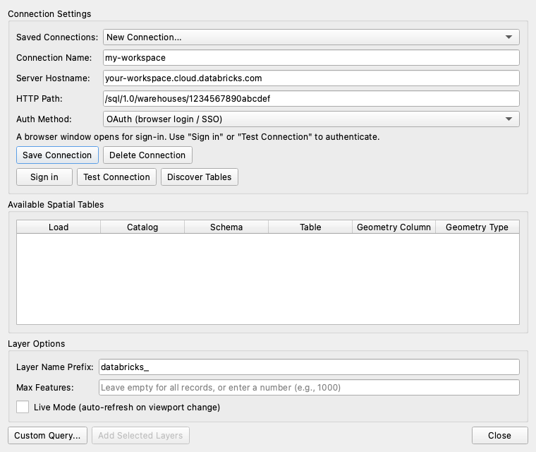
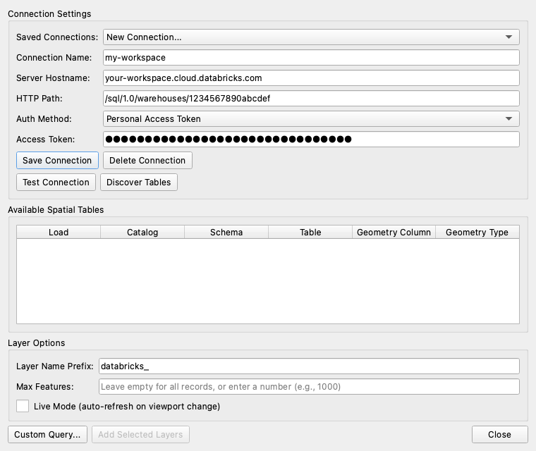

# 2. Connect to Databricks

[← Install](01-install.md) · [User guide](README.md) · Next: [Load spatial tables →](03-load-tables.md)

Open **Plugins → Databricks DBSQL Connector → Connect to Databricks SQL** (or click the Databricks toolbar icon).

## Find your connection details in Databricks
1. In your Databricks workspace, open **SQL Warehouses** and pick a warehouse (serverless recommended).
2. Open the **Connection details** tab and copy:
   - **Server hostname**, e.g. `your-workspace.cloud.databricks.com`
   - **HTTP path**, e.g. `/sql/1.0/warehouses/1234567890abcdef`

## Choose how to sign in

| | **OAuth (browser login / SSO)** (recommended) | **Personal Access Token** |
|---|---|---|
| What you need | Your normal Databricks login, including SSO | A token from Databricks (starts with `dapi`) |
| Token stored on your computer? | A refreshable sign-in, in a private file in your QGIS profile | The token, in your QGIS settings |
| Works for Genie Agent and Genie One | Yes | Yes |
| Best for | Everyday use; sharing projects with colleagues | Automation, or workspaces without OAuth |

### OAuth: sign in through your browser

1. **Connection Name:** something you'll recognise, e.g. `my-workspace`.
2. **Server Hostname** and **HTTP Path:** paste from Databricks.
3. **Auth Method:** *OAuth (browser login / SSO)*. The token field disappears and a **Sign in** button appears.
4. Click **Sign in**. A browser tab opens; sign in as usual (with SSO if your company uses it). If you're already signed in, it completes by itself.
5. Back in QGIS you'll see *"Signed in to Databricks successfully."*
6. Click **Save Connection**.

You only sign in once. The plugin refreshes the sign-in automatically, and the same session is used for table discovery, layers, live layers, the Browser panel and Genie.

### Personal access token

1. In Databricks: **Settings → Developer → Access tokens → Generate new token**. Copy it.
2. In the dialog, fill in **Connection Name**, **Server Hostname** and **HTTP Path**.
3. **Auth Method:** *Personal Access Token*, then paste the token into **Access Token**.
4. Click **Save Connection**.

## Test the connection
Click **Test Connection**. You should see *"Connection successful!"*. If not, see [Troubleshooting](11-troubleshooting.md#cant-connect).

## Saved connections
- **Saved Connections** at the top lists your connections; pick one to load it.
- **Save Connection** saves changes; **Delete Connection** removes the selected one.
- Saved connections are shared by the main dialog, the **Browser** panel, **Genie Agent** and **Genie One**.
- Layers you [save in a project](06-custom-queries.md#save-a-query-in-your-project) refer to the connection **by name**. Keep the name stable, and colleagues opening your project should use the same name.

## Next
Click **Discover Tables** to find spatial tables: see [Load spatial tables](03-load-tables.md).
