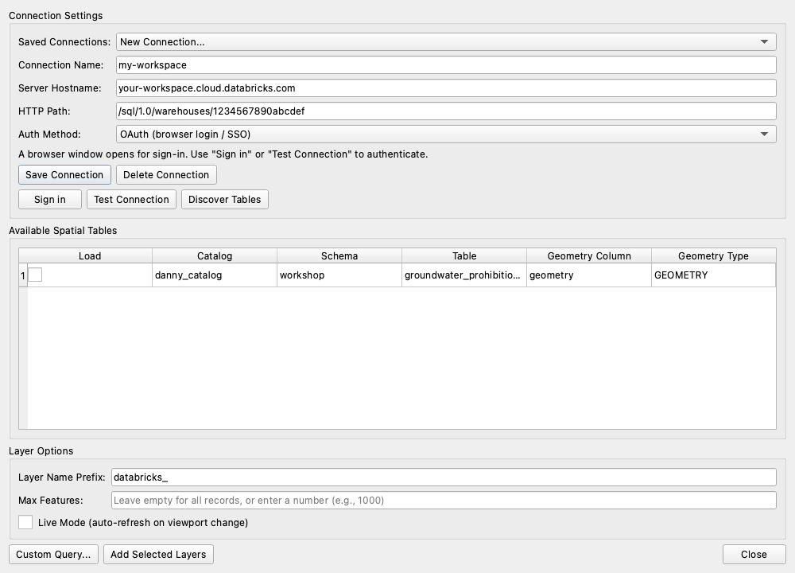

# 3. Load spatial tables

[← Connect](02-connect.md) · [User guide](README.md) · Next: [Browser panel →](04-browser-panel.md)

The main dialog finds every table you can access that has a `GEOMETRY` or `GEOGRAPHY` column, and adds it to the map.

## Steps
1. Open **Plugins → Databricks DBSQL Connector → Connect to Databricks SQL** and pick your connection under **Saved Connections**.
2. Click **Discover Tables**. **Available Spatial Tables** fills with each table's **Catalog**, **Schema**, **Table**, **Geometry Column** and **Geometry Type**.
3. Tick **Load** for the tables you want.
4. Set the **Layer Options**:
   - **Layer Name Prefix:** added to each layer name (default `databricks_`).
   - **Max Features:** leave empty to load everything, or enter a number (e.g. `1000`) to load a sample first.
   - **Live Mode (auto-refresh on viewport change):** tick to load only what's on screen. See [Live layers](05-live-layers.md).
5. Click **Add Selected Layers**.

Each table becomes a layer in the **Layers** panel. To zoom to it, right-click the layer → **Zoom to Layer(s)**.

## Good to know
- **Mixed geometry types:** a table holding points *and* lines or polygons is split into one layer per type: `<prefix><table>` for points, plus `<prefix><table>_lines` and `<prefix><table>_polygons`.
- **Layer data is a snapshot.** Layers added here hold a copy of the data. To re-load from Databricks, select the layer and choose **Plugins → Databricks DBSQL Connector → Update Layer Data from Databricks**.
- **Big tables:** use **Max Features** or **Live Mode** so you don't pull millions of rows into QGIS at once.
- **Keep a layer in your project:** layers added here are temporary copies and aren't kept when the project is closed. To save a layer in the project that re-queries Databricks on open, use [Custom Query → Save in project](06-custom-queries.md#save-a-query-in-your-project). A simple `SELECT * FROM catalog.schema.table` works.

## No tables found?
- Check you have `SELECT` permission on the tables in Unity Catalog.
- Make sure the tables really have a `GEOMETRY` or `GEOGRAPHY` column. Tables with latitude/longitude numbers can be mapped with a [custom query](06-custom-queries.md) instead: `ST_POINT(longitude, latitude, 4326) AS geom`.
