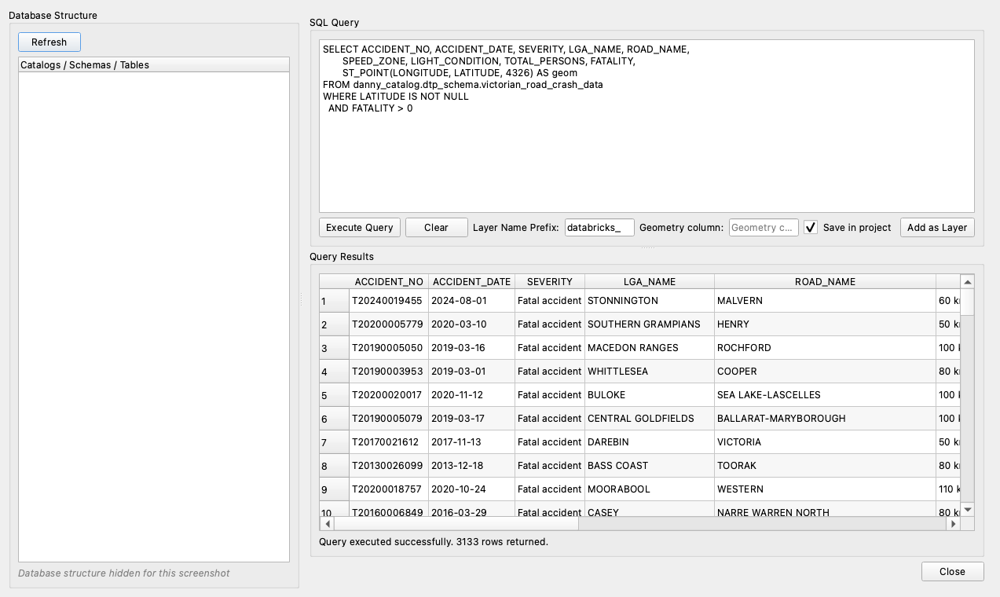

# 6. Custom SQL queries and saving them in your project

[← Live layers](05-live-layers.md) · [User guide](README.md) · Next: [Genie Agent →](07-genie-agent.md)

Write any `SELECT` against Databricks, preview the results, and add them to the map. Tick **Save in project** and the query is stored in your `.qgz`: it re-runs against Databricks every time the project opens, like a PostGIS SQL layer.



## Open Custom Query
- **Main dialog:** load a saved connection, then click **Custom Query...** (bottom left).
- **Browser panel:** right-click a connection → **Execute Custom Query...**; right-click its **⚡ Custom Query** item → **Execute Query...**; or right-click a table → **View Data...** (pre-fills `SELECT * … LIMIT 100`)

The left side, **Database Structure**, lists the catalogs, schemas and tables you can access (click **Refresh** to reload).

## Run a query
1. Type or paste your SQL into **SQL Query**.
2. Click **Execute Query**. **Query Results** shows the rows, with a summary like *"Query executed successfully. 3133 rows returned."*

### Getting geometry into a query
The layer needs a `GEOMETRY` or `GEOGRAPHY` column:
- **Tables with geometry:** select the column, e.g. `SELECT id, name, geom FROM …`.
- **Latitude/longitude numbers:** build a point with `ST_POINT(longitude, latitude, 4326) AS geom`.
- **Text (WKT):** `ST_GEOMFROMWKT(wkt_column)`; give it a coordinate system with `ST_SETSRID(…, 4326)`.
- **H3 cells:** `ST_GEOMFROMWKT(h3_boundaryaswkt(h3_cell))`.

Leave **Geometry column** empty to detect it automatically, or type the column name if your query returns more than one.

## Add the results as a layer

### Temporary layer (default)
1. Leave **Save in project** unticked.
2. Optionally change **Layer Name Prefix**.
3. Click **Add as Layer**.

The layer holds a **copy** of the results. It's fast for small results, but it's **not kept** when the project is closed.

### Save a query in your project
1. Run the query with **Execute Query** first. *Save in project* saves the query you last executed.
2. Tick **Save in project**.
3. Click **Add as Layer**. You'll see *"…saved with the project and re-queries Databricks each time the project is opened."*
4. **Save your project** (**Project → Save**, `.qgz`).

Next time anyone opens the project, the layer re-runs your query and draws. Behind the scenes:
- **Only the visible area is fetched.** Zoomed in, only nearby features load, so even large queries stay responsive.
- **Select, identify and the attribute table work**, with stable feature ids.
- **Refresh** (right-click the layer → **Refresh**, or the Refresh button) re-reads the query, picking up new data.
- **The project stores the SQL and the connection's name, never a token.** See [Security and privacy](10-security-and-privacy.md).

#### Rules for saved queries
- **One `SELECT` (or `WITH … SELECT`) statement.** A trailing `;` and `--` comments are fine; other statements are refused.
- **Personal access token connections must be saved first.** The layer refers to the connection by name, so the token stays in your QGIS settings and out of the project file. If it isn't saved, you'll see *"Save this connection first…"*. OAuth connections work either way.
- **Queries without geometry** (e.g. a summary table) become attribute-only layers: no map symbol, but the attribute table works.

### Temporary vs. saved: which to use?

| | Temporary layer | **Save in project** |
|---|---|---|
| Kept when you reopen the project | No | **Yes** |
| Data | Copy at the time you added it | Re-queried from Databricks on open and on refresh |
| Large results | Loaded all at once | Only the visible area is fetched |
| Editable in QGIS | Yes (local copy only) | Read-only |
| Needs the plugin to open the project | No | Yes |

## Share a project with saved queries
1. Save the project (`.qgz`) and send it.
2. Your colleague needs the **plugin installed** and **access to the same tables** in Databricks.
3. **OAuth layers:** they open the project and sign in with their own account. If they don't have a connection with the same name, the layer uses the workspace host and path from the project with their sign-in. Results respect *their* permissions.
4. **Personal-access-token layers:** your colleague creates a connection **with the same name** and their own token. Until then, QGIS shows the layer in **Handle Unavailable Layers**. That's expected, not an error.

## Example queries
Replace the table names with your own.

**Points from latitude/longitude**
```sql
SELECT ACCIDENT_NO, ACCIDENT_DATE, SEVERITY, LGA_NAME,
       ST_POINT(LONGITUDE, LATITUDE, 4326) AS geom
FROM my_catalog.transport.road_crashes
WHERE LATITUDE IS NOT NULL AND FATALITY > 0
```

**Hexagon hotspots (H3)**
```sql
WITH cells AS (
  SELECT h3_longlatash3(LONGITUDE, LATITUDE, 7) AS h3_cell, COUNT(*) AS crashes
  FROM my_catalog.transport.road_crashes
  WHERE LATITUDE IS NOT NULL
  GROUP BY h3_longlatash3(LONGITUDE, LATITUDE, 7)
)
SELECT h3_cell, crashes,
       ST_SETSRID(ST_GEOMFROMWKT(h3_boundaryaswkt(h3_cell)), 4326) AS geom
FROM cells
WHERE crashes >= 20
```
Style it by `crashes` for a heat map: see [Basemaps and styling](09-basemaps-and-styling.md).

**Summary table (no geometry)**
```sql
SELECT LGA_NAME, COUNT(*) AS crashes
FROM my_catalog.transport.road_crashes
GROUP BY LGA_NAME
ORDER BY crashes DESC
```
Use **Save in project** for summary tables: the temporary **Add as Layer** currently needs a geometry column.

> **Careful:** **Execute Query** runs whatever you type, including `DROP`, `UPDATE` or `DELETE`, with your own Databricks permissions. Only *Save in project* restricts what is saved.
