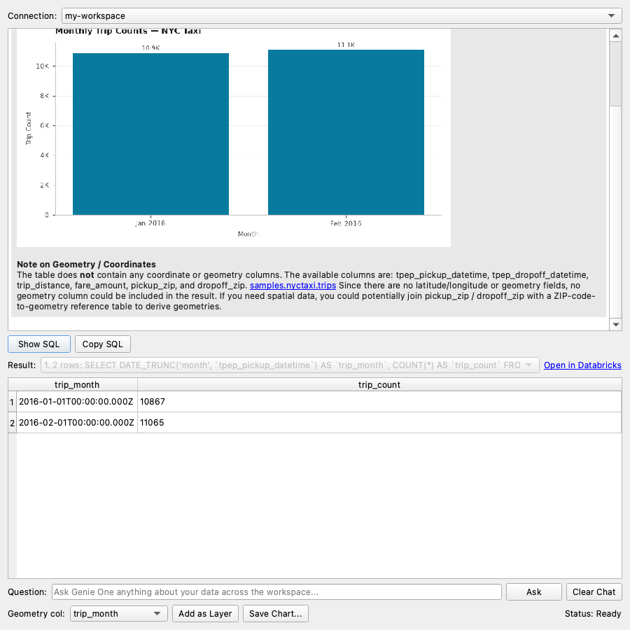

# 8. Genie One

[← Genie Agent](07-genie-agent.md) · [User guide](README.md) · Next: [Basemaps and styling →](09-basemaps-and-styling.md)

**Genie One** answers questions across your **whole workspace**: there's no Genie Agent to choose. It finds the right data, runs SQL, and can draw charts. Results with geometry can go straight onto the map.

## Ask a question
1. Open **Plugins → Databricks DBSQL Connector → Databricks Genie One**, or click the Genie lamp on the toolbar.
2. **Connection:** pick a saved connection (OAuth or personal access token).
3. Type in **Question**, e.g. *"Show monthly trip counts in samples.nyctaxi.trips as a bar chart"*, and click **Ask**.
4. Watch Genie One's progress in the chat and status bar, e.g. *"Running SQL: SELECT …"*. Click **Cancel** to stop.
5. The answer appears with **Genie One's chart** drawn where Genie places it, plus the result table.

## Use the results
| Control | What it does |
|---|---|
| **Result** | Genie One may run several queries per answer. Pick one to see its rows and SQL |
| **Open in Databricks** | Continue the same conversation in Genie One in your browser |
| **Show SQL** / **Copy SQL** | See or copy the selected query |
| **Geometry col** + **Add as Layer** | Put spatial results on the map |
| **Save Chart...** | Save the latest chart as a PNG |
| **Clear Chat** | Start a new conversation |

## Tips
- **Follow-ups** keep the conversation going, e.g. *"Only the top 5"*.
- **Charts** are drawn in QGIS from Genie One's own chart definition: bar, line, area, scatter and pie, including dual axes and stacked bars. If Genie One returns chart-shaped data without a chart, the plugin draws a simple one and labels it *"Chart drawn by the plugin…"*.
- Genie One needs to be **enabled in your workspace**. If it isn't, you'll see *"Genie One is not available on this workspace"*.
- Results respect your Unity Catalog permissions.
