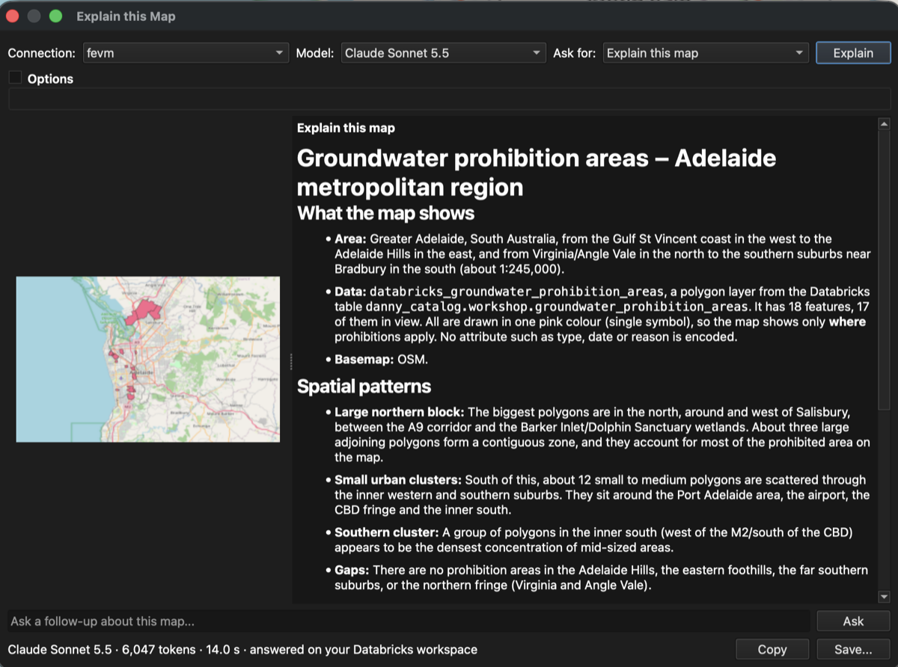
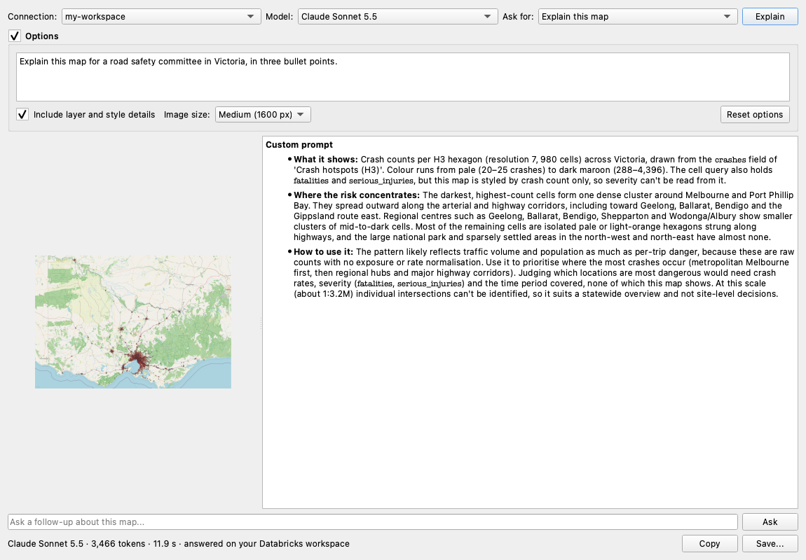

# 12. Explain this Map

[← Troubleshooting](11-troubleshooting.md) · [User guide](README.md)

**Explain this Map** sends what's on your map to a frontier model on your Databricks workspace and streams back an explanation: the area, the patterns, hotspots and outliers, and what's worth investigating next. It uses your existing Databricks sign-in, so there's **no API key and no extra subscription**.

## One click
1. Set up the map you want explained: layers, styling and zoom.
2. Click the **Explain this Map** toolbar button (a red map with a sparkle), or **Plugins → Databricks DBSQL Connector → Explain this Map**.
3. The explanation appears in a few seconds and fills in as it's written. The left side shows the image that was sent.

The first time, it uses your last-used saved connection and picks the best available model automatically. After that it remembers your choices.

It works on any map. Here it explains groundwater prohibition areas around Adelaide, a Unity Catalog table added with [Discover Tables](03-load-tables.md), shown in QGIS's dark theme:

> You need a [saved connection](02-connect.md) first. If you don't have one, the plugin opens the connection dialog for you.

## What the model sees
Alongside a sharp image of the current view, the plugin sends **map facts**, so answers use your real names and numbers instead of guessing from colours:
- coordinate system, scale and area (longitude/latitude)
- each visible layer: name, geometry type, feature count, and how many are in view
- **what each layer's style encodes**, for example *graduated by 'crashes' in 6 classes: 20-35 (#fee5d9) … 288-4396 (#67000d)*
- labels, selections, and the Databricks table or SQL behind each layer

## Optional knobs
Everything below is optional and remembered between sessions.

| Control | What it does |
|---|---|
| **Model** | Pick any model on your workspace that can read images (Claude, GPT, Gemini, Llama and more). Only image-capable models are listed |
| **Ask for** | Prompt presets: **Explain this map** · **Summary for a report** (one polished paragraph) · **Patterns and outliers** · **Title, caption and alt text** (for layouts and accessibility) · **Next analysis steps** (QGIS or Databricks SQL) |
| **Options → Custom prompt** | Write your own instruction, e.g. *"Explain this map for a road safety committee in Victoria"*. Leave it empty to use the preset |
| **Options → Include layer and style details** | Turn the map facts off to send only the image |
| **Options → Image size** | Small (1024 px), Medium (1600 px, default) or Large (2048 px). Larger shows more detail and uses more tokens. Busy maps (for example a detailed basemap) are sent as JPEG so they always fit the model's image limit |
| **Explain** | Capture the map again (after panning, restyling or changing options) and explain it |

## After the answer
- **Ask a follow-up** about the same map, e.g. *"Which areas should we prioritise?"*. The conversation continues with the same image.
- **Copy** the explanation, or **Save...** it as Markdown with the map image beside it (`.md` + `.png`, or `.jpg` for busy maps), ready for a report or wiki.
- The status line shows the model, tokens used and time taken.

## Tips
- **Style first, then explain.** A clear legend (graduated or categorised) gives the model much better material than a single colour.
- **Zoom to what matters.** The image and the facts describe the current view.
- **Add a basemap** (see [Basemaps](09-basemaps-and-styling.md)) so the model can recognise places.
- Treat the answer like a colleague's first read of the map: useful, and worth checking against your data.

## Where it runs
The image and map facts go to the model's serving endpoint **on your Databricks workspace**, using your saved connection's sign-in and your workspace's model access and governance (including AI Gateway settings, if your admins use them). Model availability depends on your workspace and region. If a model can't read images, or isn't available, you'll see a short message and can pick another in **Model**.
