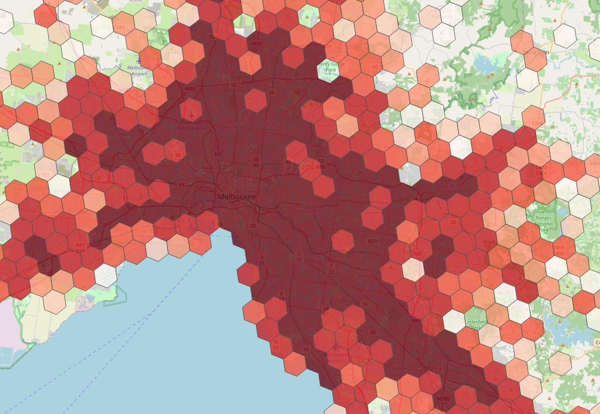

# Databricks DBSQL Connector for QGIS: User Guide

Load spatial data from Databricks into QGIS, keep SQL queries live in your projects, and ask Databricks Genie about your data, all from inside QGIS.

*A Databricks SQL query saved in a QGIS project: Victorian road-crash hotspots (H3 cells) over an OpenStreetMap basemap. Basemap © OpenStreetMap contributors.*

## Start here

| Step | Guide | You'll learn |
|---|---|---|
| 1 | [Install the plugin](01-install.md) | Install on QGIS 3 or 4 and set up the Python dependency |
| 2 | [Connect to Databricks](02-connect.md) | Sign in with OAuth (browser / SSO) or a personal access token, and save connections |
| 3 | [Load spatial tables](03-load-tables.md) | Discover tables with geometry and add them as layers |

## Working with your data

| Guide | Use it to |
|---|---|
| [Browse catalogs in the Browser panel](04-browser-panel.md) | Navigate catalogs, schemas and tables, and add layers by right-clicking |
| [Live layers](05-live-layers.md) | Load only what's on screen, refreshing as you pan and zoom |
| [Custom SQL queries and saving them in your project](06-custom-queries.md) | Turn any `SELECT` into a layer, and keep it in the `.qgz` so it re-runs when the project opens |
| [Genie Agent](07-genie-agent.md) | Ask a Genie Agent questions in plain English; see its SQL, results and charts |
| [Genie One](08-genie-one.md) | Ask questions across your whole workspace; add results to the map |
| [Basemaps and styling](09-basemaps-and-styling.md) | Add an OpenStreetMap or Esri basemap and style your layers |
| [**Explain this Map**](12-explain-this-map.md) | One click: a frontier model on your Databricks workspace explains the map, with no API key |

## Reference

| Guide | Covers |
|---|---|
| [Security and privacy](10-security-and-privacy.md) | Where credentials are stored, what goes into project files, and sharing projects safely |
| [Troubleshooting](11-troubleshooting.md) | Install, sign-in, Genie and layer problems, and where to find the logs |

## At a glance

| Feature | Where to find it |
|---|---|
| Main dialog (connections, tables, Custom Query) | **Plugins → Databricks DBSQL Connector → Connect to Databricks SQL**, or the Databricks toolbar icon |
| Genie Agent | **Plugins → Databricks DBSQL Connector → Databricks Genie Agent** |
| Genie One | **Plugins → Databricks DBSQL Connector → Databricks Genie One**, or the Genie lamp on the toolbar |
| Explain this Map | **Plugins → Databricks DBSQL Connector → Explain this Map**, or the red map-with-sparkle toolbar icon |
| Re-load a layer's data | Select the layer, then **Plugins → Databricks DBSQL Connector → Update Layer Data from Databricks** |
| Live mode on or off | Select the layer, then **Plugins → Databricks DBSQL Connector → Toggle Live Mode for Layer** |
| Browser | **Browser** panel → **Databricks** |

## Requirements
- QGIS 3.16 or later, or QGIS 4.x. Tested on QGIS 3.44 (Qt5) and QGIS 4.2 (Qt6).
- A Databricks SQL warehouse (serverless recommended) with Unity Catalog.
- Tables with `GEOMETRY` or `GEOGRAPHY` columns, or queries that build geometry, e.g. `ST_POINT(longitude, latitude, 4326)`.
- For Genie: access to a Genie Agent (Genie Agent dialog) or to Genie One (Genie One dialog).
